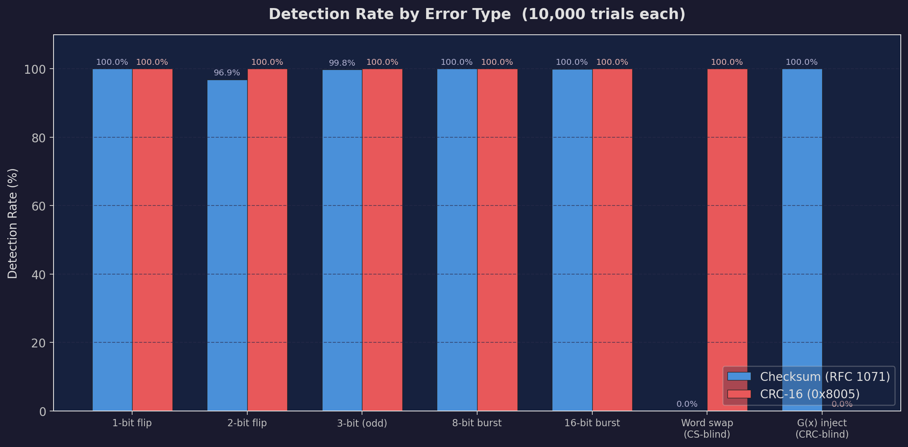
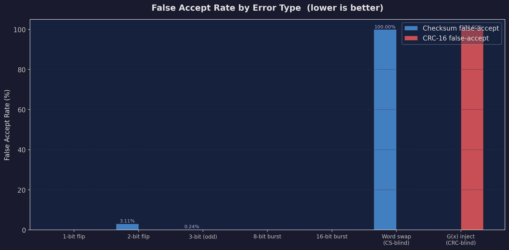
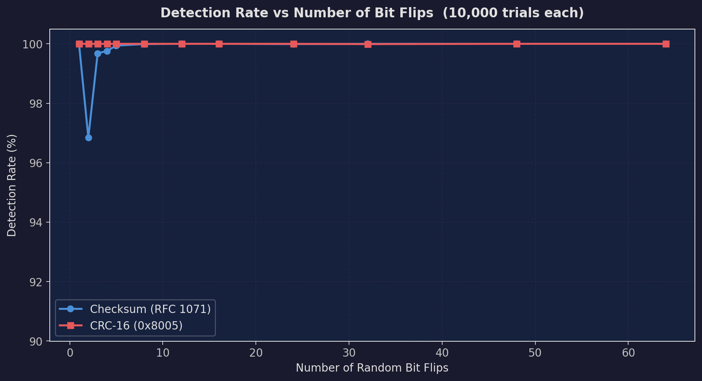
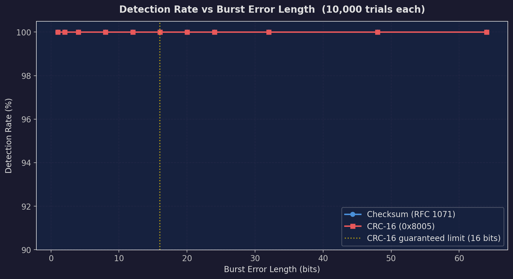

# Error Detection using Checksum and CRC-16 over TCP

A sender–receiver system that builds 64-byte Ethernet-like frames, computes **16-bit Internet Checksum** and **CRC-16**, injects controlled errors, and compares both schemes' detection ability over a TCP link.

---

## Project Structure

```
assignment1/
├── frame.h        # Frame struct, constants, calc_checksum(), calc_crc()
├── error.h        # Error type codes, inject_error(), inject_random_error(), err_name()
├── sender.c       # Reads input, builds frames, injects errors, sends over TCP
├── receiver.c     # Listens on TCP, receives frames, recomputes FCS, prints verdict
├── input.txt      # 11 lines of sample payload data
├── metrics.py     # Monte Carlo simulation for detection metrics + plot generation
├── plots/         # Generated metric plots (see below)
└── README.md      # This file
```

- **`frame.h`** — Shared header containing the packed `frame_t` structure, all size/port constants, and both error-detection functions (`calc_checksum`, `calc_crc`) as `static inline` so both sender and receiver compile with identical logic.
- **`error.h`** — All error injection logic: deterministic (`inject_error`) and randomised (`inject_random_error`), plus the `err_name()` helper and error-type `#define`s.
- **`sender.c`** — Includes `frame.h` and `error.h`, builds frames from `input.txt`, and sends them.
- **`receiver.c`** — Includes only `frame.h` (it does not inject errors), receives frames, and verifies them.

---

## How to Compile and Run

```bash
# Compile
gcc -o sender   sender.c   -Wall -Wextra
gcc -o receiver receiver.c -Wall -Wextra

# Run receiver first (on the receiving machine / terminal)
./receiver

# Run sender (on the sending machine / terminal)
./sender <receiver_ip> input.txt
```

- Both programs use **TCP port 5050** (configurable in `frame.h`).
- Can be tested on **localhost** (`127.0.0.1`) or across two machines on the same network (e.g., phone hotspot).

---

## Input / Output Flow

```
┌──────────┐   input.txt    ┌──────────┐   TCP (port 5050)    ┌──────────┐
│          │  ───────────►  │          │  ─────────────────►  │          │
│  File    │   11 lines     │  Sender  │   64-byte frames     │ Receiver │
│          │                │          │   (with errors)       │          │
└──────────┘                └──────────┘                       └──────────┘
                                                                   │
                                                                   ▼
                                                          Recompute CS & CRC
                                                          Print ACCEPT/REJECT
                                                          Print Summary
```

1. **Sender** reads 11 lines from `input.txt`.
2. For each line, it builds a `frame_t`:
   - Fills MAC addresses, frame number, payload.
   - Computes checksum and CRC over `HEADER_SIZE + PAYLOAD_SIZE` bytes (FCS is zeroed during computation).
   - Stores the results in `fcs[0..3]`.
   - Injects a planned error (if any) into the payload **after** computing FCS.
3. Sends the 64-byte frame over TCP.
4. **Receiver** reads the frame, extracts the stored FCS, zeros the FCS field, recomputes checksum and CRC, and compares.
5. Prints per-frame verdict (`ACCEPTED` / `REJECTED`) and a final summary.

---

## Frame Layout

| Offset | Size (bytes) | Field           | Description                        |
|--------|-------------:|:----------------|:-----------------------------------|
| 0      | 6            | `dest_mac`      | Destination MAC address            |
| 6      | 6            | `src_mac`       | Source MAC address                 |
| 12     | 2            | `payload_len`   | Actual payload length (before pad) |
| 14     | 2            | `frame_no`      | Sequence number (0 – 10)           |
| 16     | 44           | `payload`       | Data (zero-padded to 44 bytes)     |
| 60     | 4            | `fcs`           | `[0..1]` = Checksum, `[2..3]` = CRC |

**Total: 64 bytes** (packed with `#pragma pack(push, 1)`).

---

## Implementation Highlights

### 1. 16-bit Internet Checksum (RFC 1071)

Defined in `frame.h` and used by both sender and receiver.

```c
static inline uint16_t calc_checksum(uint8_t *data, int len) {
    uint32_t sum = 0;
    for (int i = 0; i < len; i += 2) {
        uint16_t word = (data[i] << 8) + (i < len - 1 ? data[i + 1] : 0);
        sum += word;
        while (sum >> 16)
            sum = (sum & 0xFFFF) + (sum >> 16);
    }
    return (uint16_t)(~sum);
}
```

- Reads data as big-endian 16-bit words.
- Accumulates with end-around carry (fold overflow back into the lower 16 bits).
- Returns the one's complement of the sum.
- **Limitation**: The checksum is a simple modular sum — swapping two 16-bit words produces the same checksum (addition is commutative), making it blind to reordering errors.

### 2. CRC-16 (Polynomial 0x8005)

Also defined in `frame.h`.

```c
static inline uint16_t calc_crc(uint8_t *data, int len) {
    uint16_t crc = 0;
    for (int p = 0; p < len; p++) {
        crc ^= (uint16_t)data[p] << 8;
        for (int i = 0; i < 8; i++) {
            crc = (crc & 0x8000) ? (crc << 1) ^ 0x8005 : (crc << 1);
        }
    }
    return crc;
}
```

- Uses polynomial `x^16 + x^15 + x^2 + 1` (hex `0x8005`).
- Processes data one byte at a time, shifting through 8 bits.
- XORs with the polynomial whenever the MSB is set (standard CRC division).
- **Strength**: Detects all single-bit, two-bit, odd-count bit, and burst errors ≤ 16 bits. Only blind to errors that are exact multiples of the generator polynomial.

### 3. Error Injection

Defined in `error.h`. Two variants are available:

#### Deterministic (`inject_error`) — Fixed positions, predictable results:

| Type          | What it does                                              |
|:--------------|:----------------------------------------------------------|
| `ERR_SINGLE`  | Flips bit 3 of `payload[5]`                               |
| `ERR_TWO_ISOL`| Flips bit 2 of `payload[3]` and bit 6 of `payload[25]`   |
| `ERR_ODD`     | Flips 3 bits across `payload[1]`, `[15]`, `[35]`         |
| `ERR_BURST`   | Inverts all 8 bits of `payload[10]`                       |
| `ERR_CS_FALSE`| Swaps `payload[0..1]` with `payload[2..3]` (word-swap)   |
| `ERR_CRC_FALSE`| XORs 3 bytes with G(x) bit pattern so CRC stays valid   |

#### Randomised (`inject_random_error`) — Random positions, same error class:

```c
case ERR_SINGLE:
    /* flip exactly one random bit in a random payload byte */
    idx = rand() % PAYLOAD_SIZE;
    bit = rand() % 8;
    f->payload[idx] ^= (1 << bit);
    break;
```

- **ERR_SINGLE**: Picks a random byte and a random bit — flips exactly 1 bit (original code was `^= (rand() % 256)` which could XOR with 0 and produce no error).
- **ERR_TWO_ISOL**: Picks two distinct random bytes, flips one bit each (original was missing the second flip).
- **ERR_CS_FALSE**: Performs a proper 16-bit word swap (original had a broken swap: `payload[y] = payload[y]` was a no-op).
- **ERR_BURST**: Flips 1–8 contiguous bytes with guaranteed non-zero XOR values.
- **ERR_CRC_FALSE**: XORs the G(x) pattern at a random offset.

### 4. Verification at Receiver

The receiver uses the **same** `calc_checksum` and `calc_crc` functions from `frame.h`:

```c
/* extract stored FCS values */
uint16_t stored_cs  = ((uint16_t)f.fcs[0] << 8) | f.fcs[1];
uint16_t stored_crc = ((uint16_t)f.fcs[2] << 8) | f.fcs[3];

/* zero FCS before recomputing */
memset(f.fcs, 0, FCS_SIZE);

/* recompute */
uint16_t recv_cs  = calc_checksum((uint8_t *)&f, HEADER_SIZE + PAYLOAD_SIZE);
uint16_t recv_crc = calc_crc((uint8_t *)&f, HEADER_SIZE + PAYLOAD_SIZE);
```

- FCS is zeroed before recomputation because the sender also computed over zeroed FCS bytes.
- Stored vs. recomputed values are compared; mismatch → `REJECTED`.

---

## Error Cases and Expected Verdicts

| Frame | Error Type               | Checksum | CRC-16   | Reason                                                                |
|:-----:|:-------------------------|:---------|:---------|:----------------------------------------------------------------------|
| 0     | None (clean)             | ACCEPT   | ACCEPT   | No error injected — both match.                                       |
| 1     | Single-bit               | REJECT   | REJECT   | One bit flipped — both detect.                                        |
| 2     | Two isolated bits        | REJECT   | REJECT   | Two bits in different bytes — both detect.                             |
| 3     | Odd (3 bits)             | REJECT   | REJECT   | Odd number of flipped bits — both detect.                             |
| 4     | Burst (8 bits)           | REJECT   | REJECT   | 8 contiguous bits inverted — both detect.                             |
| 5     | None (clean)             | ACCEPT   | ACCEPT   | No error — both match.                                                |
| 6     | Word-swap (CS blind)     | **ACCEPT** ⚠️ | REJECT   | Two 16-bit words swapped — checksum sum unchanged (commutative), CRC catches. |
| 7     | Single-bit               | REJECT   | REJECT   | Both detect.                                                          |
| 8     | Burst                    | REJECT   | REJECT   | Both detect.                                                          |
| 9     | None (clean)             | ACCEPT   | ACCEPT   | No error — both match.                                                |
| 10    | CRC false (G(x) inject)  | REJECT   | **ACCEPT** ⚠️ | Error is a multiple of G(x) so CRC remainder stays 0, but checksum changes. |

- **Frame 6** demonstrates a **checksum false-accept**: the error goes undetected by checksum but is caught by CRC.
- **Frame 10** demonstrates a **CRC false-accept**: the error is invisible to CRC but is caught by checksum.

---

## Detection Performance Summary

### With the 11-frame test set (deterministic errors):

| Metric                 | Checksum (RFC 1071) | CRC-16 (0x8005) |
|:-----------------------|:-------------------:|:---------------:|
| Total frames           | 11                  | 11              |
| Correctly accepted     | 3                   | 3               |
| Correctly rejected     | 7                   | 7               |
| **False accepts**      | **1** (frame 6)     | **1** (frame 10)|
| Detection rate         | 87.5% (7/8)         | 87.5% (7/8)     |

### Theoretical detection capability:

| Error Pattern                     | Checksum | CRC-16 |
|:----------------------------------|:--------:|:------:|
| Single-bit errors                 | ✅ Always | ✅ Always |
| Two-bit errors                    | ✅ Always | ✅ Always |
| Odd number of bit errors          | ✅ Always | ✅ Always (since G(x) has factor (x+1)) |
| Burst errors ≤ 16 bits            | ❌ Not guaranteed | ✅ Always |
| Burst errors > 16 bits            | ❌ Not guaranteed | ❌ Probability ≈ 1 − 2⁻¹⁶ |
| Byte/word reordering              | ❌ **Blind** (sum is commutative) | ✅ Detects |
| Errors that are multiples of G(x) | ✅ Detects | ❌ **Blind** |

### Key takeaway:
- **Checksum** is fast and simple but has a mathematical blind spot: any error that preserves the modular sum goes undetected (e.g., word swaps, compensating byte changes).
- **CRC-16** catches all burst errors up to 16 bits and is sensitive to bit-position, but is blind to errors that exactly match the generator polynomial.
- **Using both together** (as done here) provides complementary coverage — what one misses, the other catches.

---

## Monte Carlo Detection Metrics

The `metrics.py` script reimplements `calc_checksum` and `calc_crc` in Python and runs **10,000 randomised trials** per test point to measure empirical detection performance.

```bash
python metrics.py      # generates all plots in plots/
```

### 1. Detection Rate by Error Type



- **Both methods achieve 100% detection** for single-bit flips.
- **CRC-16 achieves 100%** on all standard error classes (1-bit, 2-bit, odd, burst up to 16 bits).
- **Checksum drops to ~96.9%** on 2-bit flips — two flips can occasionally cancel each other out in the 16-bit word sum.
- **Word-swap errors**: Checksum has a **0% detection rate** (completely blind), while CRC catches all of them.
- **G(x)-multiple errors**: CRC has a **0% detection rate** (completely blind), while Checksum catches all of them.

### 2. False Accept Rate by Error Type



- Checksum false-accepts **100% of word-swap errors** — its fundamental weakness.
- CRC false-accepts **100% of G(x)-multiple errors** — its fundamental weakness.
- For standard random errors (bit flips, bursts), both have negligible false-accept rates (<0.01% for CRC, ~3% for Checksum on 2-bit errors).

### 3. Detection Rate vs Number of Bit Flips



- **CRC-16 stays at or very near 100%** regardless of how many bits are flipped.
- **Checksum detection dips slightly** for even numbers of flips (two errors can cancel in the word-sum) but recovers as more bits are flipped (cancellation becomes statistically unlikely).
- Both methods converge to ~100% detection for large numbers of random bit flips.

### 4. Detection Rate vs Burst Error Length



- **CRC-16 guarantees 100% detection for bursts ≤ 16 bits** (the gold vertical line marks this boundary).
- Beyond 16 bits, CRC detection remains very high (~99.997%) but is no longer guaranteed.
- **Checksum detection stays above 99.9%** for bursts but without any hard guarantee at any length.

### Empirical Results Summary (10,000 trials)

| Error Type          | Checksum Detection | CRC-16 Detection | Checksum False-Accept | CRC-16 False-Accept |
|:--------------------|:------------------:|:----------------:|:---------------------:|:-------------------:|
| 1-bit flip          | 100.00%            | 100.00%          | 0.00%                 | 0.00%               |
| 2-bit flip          | 96.89%             | 100.00%          | 3.11%                 | 0.00%               |
| 3-bit (odd)         | 99.76%             | 100.00%          | 0.24%                 | 0.00%               |
| 8-bit burst         | 100.00%            | 100.00%          | 0.00%                 | 0.00%               |
| 16-bit burst        | 99.99%             | 100.00%          | 0.01%                 | 0.00%               |
| Word swap (CS-blind)| 0.00%              | 100.00%          | **100.00%**           | 0.00%               |
| G(x) inject (CRC-blind) | 100.00%       | 0.00%            | 0.00%                 | **100.00%**         |

---

## Possible Improvements

- **Stronger CRC polynomial**: Upgrade to CRC-32 (used in Ethernet, ZIP) for guaranteed detection of all bursts ≤ 32 bits and better random-error coverage (~1 in 4 billion miss rate).
- **HMAC / cryptographic integrity**: For security-sensitive applications, add HMAC-SHA256 to detect intentional tampering (CRC and checksum only protect against accidental errors).
- **Sequence numbers and ACK/NAK**: Currently the sender fire-and-forgets. Adding ARQ (Automatic Repeat reQuest) with timeouts would allow retransmission of rejected frames.
- **Larger payload support**: The 44-byte fixed payload limits practical use. Variable-length payloads with a length field would be more realistic.
- **UDP mode**: TCP already provides its own error detection (TCP checksum) and reliable delivery. Testing over raw UDP would better demonstrate the frame-level error detection since TCP masks transport errors.
